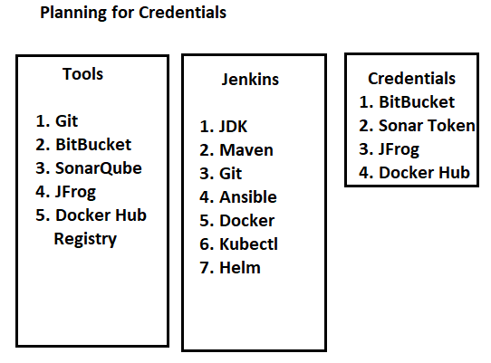
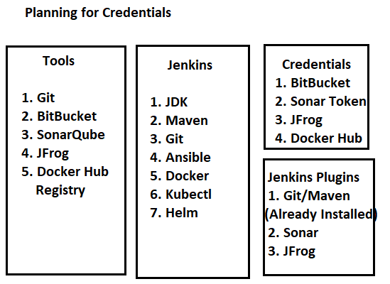
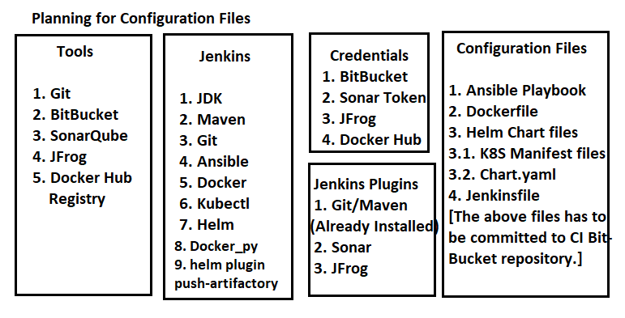

This Project is an complete CI/CD Automation Project.

I'm using Jenkins to automate Build & Deployment Pipelines also called as CI & CD Pipelines.

Below image depicts the overview of the CI/CD Pipeline Project.

1. Developer commits the code to the Bit Bucket repository in the respective branches.
2. Once the code is approved and merged to specific branch, The role of DevOps engineer will start. 
3. Jenkins acts as a DevOps engineer and performs build and deployment. All I have to do is configure the Jenkins Server with correct configurations.
4. Jenkins will take the code from Bit Bucket, do the Maven build, push the code for SonarQube analysis, once the quality gate is passed, the artifact will be pushed to JFrog artifactory. 
5. With the help of Ansible Play books, jenkins will create a Docker container image from the artifact in Jfrog Artifact and publish it to the docker registry. 
6. This image is used to deploy into specific namespaces through Kubernetes. 

But, having the CI & CD pipelines combined is not a best practice. As a best practice, I will split the Pipeline into 2 pipelines, one for CI Pipeline and other for CD pipeline. 

CI Pipeline
-----------

1. In the CI pipeline, the role of the Jenkins is to clone the bit bucket repository code, perform the maven build process, push the code for SonarQube analysis, once the quality gate is passed, the artifact is pushed to JFrog artifactory. 
2. Jenkins will execute ansible playbook to create the Docker container image from the artifact and publish it to the docker hub registry.
3. I need to create Kubernetes deployment, service manifest files.  
4. Jenkins will create the helm charts. In this helm chart, the values are not hard coded. The values will be variablised according to the environment type. 
5. The helm charts are again pushed to JFrog artifactory. 

CD Pipeline
-----------

1. Once the Integration is done and helm chart is available in artifactory, I need to perform the deployment into various environments one by one, at first Dev environment.
2. Prepare the values.yaml file for each environment, and commit the multiple values.yaml files into 2nd bit bucket repository. 
3. In here, I will create multiple branches for each environment type and have values.yaml file created for each branch. 
4. The pipeline will fetch the required files from the bit bucket for each environment type and go to artifactory to download the helm charts and apply the values from values.yaml file at the time of deployment to specific environment. 

In this entire process, CI pipeline job will run one time and CD pipeline job will run 4 times as per the environment type. The pipeline will not deploy in all the environment at once. At first the code is deployed in to Dev environment. After the validation and approvals, the code is deployed into QA environment. Again after the validation and approvals the same process will continue till deployment into Production environment. 

All the above configurations is specified in the Jenkinsfile in the declarative way.

Implementation of CI/CD Pipelines
=================================

Phase 1: Planning 
-----------------

A. Planning Tools

At first, before implementing planning is very important.

1. I need to identify what are the tools I need to configure in the Jenkins server to implement CI/CD pipelines. 
2. For CI pipeline I need to install JDK, Maven, Git. 
3. For configuring SonarQube and JFrog nothing has to be installed, All the commands are ran from Maven.
4. For CD pipelines I need to install Ansible, Docker, Docker_py, Kubectl, Helm.

As of now I am installing all these tools in Jenkins control node. If using Jenkins Agent, I need to make sure that all these components are installed in each slave node.

B. Planning for Credentials

I have to supply the required credentials to Jenkins to authenticate with different tools. 
I need to provide credentials for 
1. BitBucket 
2. SonarQube Token 
3. Jfrog 
4. Docker Hub Registry (Ansible) 

C. Planning for Jenkins Plugins

The Plugins need to be configured are
1. Git/Maven (Already Installed)
2. Sonar 
3. Jfrog artifactory

Depending on my project scenario, I am not installing Ansible plugin as I need Ansible to run a playbook file.

D. Planning for Configuration files

1. I need to provide Ansible playbook to Jenkins, so that it can fetch the artifact from Jfrog artifactory and creating the docker image and push it to docker hub registry.
2. I need to provide a Dockerfile to Ansible Playbook, the playbook will use the Dockerfile so that it can create an docker image. The Dockerfile will point to the artifact that it had to load while creating the image. 
3. I need to provide the Kubernetes deployment, service manifest files to helm in the specified helm directed hierarchy. The manifest files are variabilize and data is fetched from values.yaml file.
4. All the above configuration files along with Source Code (already committed by Developer) has to be committed to bitbucket repository used for CI Pipeline. 

Ideally, while planning for Automation, At first I need to execute it manually and identify the requirements. Once I identified the dependencies, ran the steps manually, then start Automating the process.  

5. Now, in order to inform Jenkins to execute the steps in orderly manner, I need to provide Jenkinsfile with all the instructions discussed above in a loosely coupled manner (Stages) i.e. a declarative pipeline.

Execution of CI/CD Pipeline
===========================
1. At first login to the Jenkins and make sure all the tools are installed. 
2. While installing kubectl, I have to make sure that it is pointing to kubernetes control plane API server. 
3. After installing Helm, I also need to install plugin "Plugin-Artifactory" so that helm charts can be pushed to JFrog artifactory.
4. Currently I am preparing the infrastructure part. This can also be done through Terraform or Ansible. In this project, I am not doing Infrastructure automations, as I have already done Infrastructure automation in the 1st project, at present main focus is on Application automation. 
5. I have installed Jenkins plugins as mentioned above after installing all the tools. 
6. Once the plugins are installed, need to store the credentials for GIT, Sonar Token, & JFrog under Credentials Manager in Jenkins Server. 
7. I also need to edit the pom.xml file with SonarCloud properties and  
8. Now create the Dockerfile. In the Dockerfile, it will get the lastest tomcat image from the docker registry and copy my customized .war file to tomcat webapps folder and create an image out of it. 
9. 

